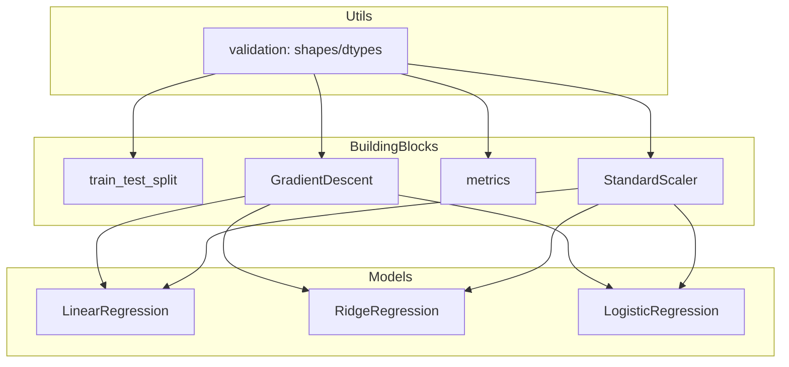

# miniML — a machine learning library from scratch (project spec)

This repo upgrades from a single “linear regression from scratch” script into **miniML**: a small, educational machine learning library written in Python.

The goal is to be:
- **From scratch**: implement the algorithms yourself (use NumPy for array math)
- **Professional**: clear package structure, unit tests, docs, reproducibility, Docker
- **Demoable**: a minimal Hugging Face Space showing training + predictions

---

## Scope (what miniML includes)

### Models
- **Linear Regression** (batch gradient descent)
- **Ridge Regression** (L2 regularization)
- **Logistic Regression** (binary classification)

### Preprocessing
- **StandardScaler** (`fit`, `transform`, `fit_transform`, `inverse_transform`)

### Data utilities
- **train_test_split** (shuffle + seed)

### Optimization
- **Gradient Descent** optimizer (batch GD for MVP)

### Metrics
Regression:
- MSE, MAE, RMSE, $R^2$

Classification:
- accuracy

### Engineering deliverables
- Unit tests (pytest)
- Docker (reproducible tests + optional demo)
- Hugging Face demo (simple UI)
- Documentation + architecture diagrams

---

## Non-goals (to keep the project focused)

- No deep learning / autograd engine
- No GPU support
- No full scikit-learn feature parity
- No hyperparameter search framework in v1

---

## API conventions (sklearn-inspired)

Use a consistent, predictable API:

Estimators:
- `fit(X, y) -> self`
- `predict(X) -> np.ndarray`

Logistic regression additionally:
- `predict_proba(X) -> np.ndarray` (probability of class 1)

Transformers:
- `fit(X) -> self`
- `transform(X) -> np.ndarray`
- `fit_transform(X) -> np.ndarray`

Input contract:
- `X`: shape `(n_samples, n_features)` (accept 1D and normalize internally)
- `y`: shape `(n_samples,)`
- Raise clear `ValueError` messages on mismatched shapes

---

## Proposed package layout

Target structure (not necessarily the current structure yet):

```
miniml/
  __init__.py
  core/
    base.py              # BaseEstimator / BaseTransformer
    validation.py        # shape + dtype checks
  model_selection/
    split.py             # train_test_split
  preprocessing/
    standard_scaler.py
  optim/
    gradient_descent.py
  metrics/
    regression.py        # mse, mae, rmse, r2
    classification.py    # accuracy
  linear_model/
    linear_regression.py
    ridge_regression.py
    logistic_regression.py
tests/
  test_split.py
  test_scaler.py
  test_metrics.py
  test_linear_regression.py
  test_ridge_regression.py
  test_logistic_regression.py
demo/
  app.py                 # Hugging Face Space (e.g., Gradio)
docs/
  index.md
  architecture.md
Dockerfile
pyproject.toml (or requirements.txt)
README.md
```

---

## Architecture diagram

High-level dependency direction (validation at the bottom, estimators at the top):



---

## Minimal usage examples

### Regression

```python
import numpy as np

from miniml.model_selection import train_test_split
from miniml.preprocessing import StandardScaler
from miniml.linear_model import LinearRegressionGD
from miniml.metrics.regression import mse, rmse, r2_score

X = np.array([[10.33], [21.52], [11.67], [6.72]])
y = np.array([57, 92, 57, 55])

X_train, X_test, y_train, y_test = train_test_split(X, y, test_size=0.25, seed=42)

scaler = StandardScaler()
X_train_s = scaler.fit_transform(X_train)
X_test_s = scaler.transform(X_test)

model = LinearRegressionGD(learning_rate=1e-2, epochs=2000)
model.fit(X_train_s, y_train)

pred = model.predict(X_test_s)
print("MSE:", mse(y_test, pred))
print("RMSE:", rmse(y_test, pred))
print("R2:", r2_score(y_test, pred))
```

### Classification

```python
import numpy as np

from miniml.linear_model import LogisticRegressionGD
from miniml.metrics.classification import accuracy

X = np.array([[0.2], [1.1], [1.8], [2.2]])
y = np.array([0, 0, 1, 1])

clf = LogisticRegressionGD(learning_rate=0.1, epochs=2000)
clf.fit(X, y)

pred = clf.predict(X)
print("Accuracy:", accuracy(y, pred))
```

---

## Unit tests (quality bar)

Use `pytest` and test both **correctness** and **API contracts**.

Minimum test set:
- `train_test_split`: sizes, determinism with seed, shuffling behavior
- `StandardScaler`: mean≈0 and std≈1 on train set; inverse_transform round-trip
- Metrics: known small arrays; $R^2$ edge cases (constant targets)
- Linear/Ridge: loss decreases on simple synthetic data; weights close to expected
- Logistic: accuracy improves on linearly separable synthetic data; `predict_proba` in [0, 1]

---

## Docker

Goal: run tests in a clean environment and optionally run the demo.

Example commands (intended UX):
- Build: `docker build -t miniml .`
- Run tests: `docker run --rm miniml pytest -q`
- Run demo: `docker run --rm -p 7860:7860 miniml python demo/app.py`

---

## Hugging Face demo (Space)

Keep it minimal and clear:
- choose model: Linear / Ridge / Logistic
- choose hyperparameters: learning rate, epochs, (ridge alpha)
- choose data: built-in small dataset or upload CSV
- show outputs: metrics + prediction sample (optional plot)

Implementation suggestion: a single `demo/app.py` using Gradio.

---

## Documentation deliverables

Small but real docs set:
- README: quickstart, install, what’s implemented
- API reference: classes + functions, parameters, and examples
- Architecture: the diagram above + design decisions (input shapes, determinism, vectorization)

---

## Milestones (recommended order)

1) Core validation utilities
2) `train_test_split` + `StandardScaler`
3) Metrics (MSE/MAE/RMSE/R²/accuracy)
4) Linear regression (GD) + tests
5) Ridge regression + tests
6) Logistic regression + tests
7) Packaging + Docker
8) Hugging Face demo + docs polish

---

## Resume bullets (examples)

- Built a from-scratch ML mini-library in Python (NumPy) implementing linear, ridge, and logistic regression trained with gradient descent, plus standard scaling, train/test split, and metrics.
- Shipped unit tests, Dockerized reproducible runs, and a minimal Hugging Face demo with architecture documentation.
