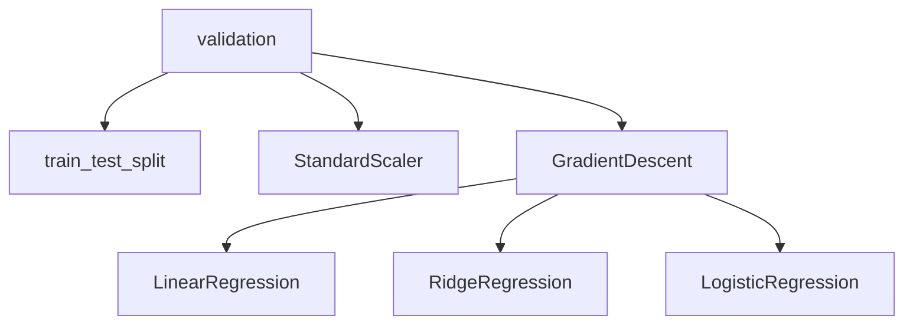

# miniML — Step-by-step tutorial (build the project end-to-end)

This tutorial is a detailed, practical checklist for building **miniML**, a from-scratch machine learning mini-library in Python.

Target deliverables (what “done” means):
- Library package with sklearn-like APIs (`fit/predict/transform`)
- Models: Linear Regression (GD), Ridge Regression (L2), Logistic Regression (binary)
- Preprocessing: StandardScaler
- Data utility: train/test split
- Metrics: MSE, MAE, RMSE, R², accuracy
- Unit tests (pytest)
- Dockerfile to run tests (and optionally the demo)
- Hugging Face demo (minimal UI)
- Documentation + architecture diagrams

---

## 0) Prerequisites

Install:
- Python 3.10+ (3.11 is fine)
- Git

Recommended:
- VS Code + Python extension

---

## 1) Decide your “MVP rules” (avoid scope creep)

Write these rules at the top of your README so you stick to them:
- **Core dependency**: NumPy (and only small extras when needed)
- **No scikit-learn** for implementations (you can optionally compare later in examples)
- **From-scratch** algorithms, but **engineering quality** is required (tests + docs)

Definition of MVP “done”:
- Each public function/class has:
  - clear docstring
  - predictable input shapes
  - at least 2–5 unit tests

---

## 2) Create the target folder structure

Goal: make this a real *library*, not a single script.

Create this structure (exact names are flexible, but keep the separation):

```
miniml/
  __init__.py
  core/
    base.py
    validation.py
  model_selection/
    split.py
  preprocessing/
    standard_scaler.py
  optim/
    gradient_descent.py
  metrics/
    regression.py
    classification.py
  linear_model/
    linear_regression.py
    ridge_regression.py
    logistic_regression.py

tests/
  test_split.py
  test_scaler.py
  test_metrics.py
  test_linear_regression.py
  test_ridge_regression.py
  test_logistic_regression.py

examples/
  quickstart_regression.py
  quickstart_classification.py

demo/
  app.py

docs/
  architecture.md
  api.md

pyproject.toml
README.md
Dockerfile
```

Acceptance criteria:
- You can run `python -c "import miniml; print(miniml.__version__)"` after installing locally.
- `pytest` discovers and runs tests.

---

## 3) Set up packaging (pyproject.toml)

Goal: `pip install -e .` works so examples can import `miniml` cleanly.

Minimum guidance:
- Use `pyproject.toml`
- Declare dependencies:
  - `numpy`
  - `pytest` (dev/test)

Acceptance criteria:
- `pip install -e .` installs the package
- `python -c "import miniml"` succeeds

---

## 4) Define core conventions (validation + base classes)

### 4.1 Input shape normalization

Create helpers in `miniml/core/validation.py`:
- `as_2d(X)`
  - if `X.ndim == 1`, convert to `(n_samples, 1)`
- `as_1d(y)`
  - enforce `(n_samples,)`
- `check_X_y(X, y)`
  - lengths match
  - numeric dtype
  - no NaNs (either raise or sanitize; prefer raise in v1)

Acceptance criteria:
- Clear `ValueError` messages for:
  - `X` and `y` having different number of rows
  - non-numeric inputs

### 4.2 Base classes

In `miniml/core/base.py`, define simple base protocols:
- `BaseEstimator` with `fit`, `predict`
- `BaseTransformer` with `fit`, `transform`, `fit_transform`

Keep this minimal: it’s mostly for consistency and docs.

---

## 5) Implement train/test split

File: `miniml/model_selection/split.py`

Function:
- `train_test_split(X, y, test_size=0.2, seed=None, shuffle=True)`

Rules:
- `test_size` can be float (0–1) or int
- Deterministic output when `seed` is set

Tests (in `tests/test_split.py`):
- correct sizes
- reproducibility with seed
- no overlap/leakage between train and test indices

---

## 6) Implement StandardScaler

File: `miniml/preprocessing/standard_scaler.py`

API:
- `fit(X)` stores `mean_`, `scale_`
- `transform(X)` returns standardized values
- `inverse_transform(X)` returns original scale

Edge cases:
- feature with zero variance → either keep scale as 1 or raise (document the choice)

Tests (in `tests/test_scaler.py`):
- `fit_transform` makes training features mean≈0 and std≈1
- `inverse_transform(transform(X))` returns `X` approximately

---

## 7) Implement metrics

Files:
- `miniml/metrics/regression.py`: `mse`, `mae`, `rmse`, `r2_score`
- `miniml/metrics/classification.py`: `accuracy`

Rules:
- Input arrays should be same length
- Return Python floats

Tests (in `tests/test_metrics.py`):
- known small arrays with exact expected values
- `r2_score` constant target edge case (should handle without crashing)

---

## 8) Implement the optimizer (Gradient Descent)

File: `miniml/optim/gradient_descent.py`

Goal: one reusable training loop component.

Recommended interface:
- A function or small class that repeatedly:
  - calls a loss/gradient function
  - updates parameters
  - optionally logs loss

MVP choice:
- Batch gradient descent only

Acceptance criteria:
- Supports:
  - `learning_rate`
  - `epochs`
  - optional `verbose_every`
  - `loss_history_` collection

---

## 9) Implement Linear Regression (GD)

File: `miniml/linear_model/linear_regression.py`

Model:
- $\hat{y} = Xw + b$
- Loss: MSE

Implementation notes:
- Use vectorized NumPy math
- Store learned attributes after fit:
  - `coef_` (shape `(n_features,)`)
  - `intercept_` (float)
  - `n_features_in_`
  - optional `loss_history_`

Tests (in `tests/test_linear_regression.py`):
- Fit on synthetic linear data → coefficients close to expected
- Loss decreases over epochs (at least for a sane learning rate)

---

## 10) Implement Ridge Regression (L2)

File: `miniml/linear_model/ridge_regression.py`

Model:
- Same as linear regression, but add L2 penalty:
  - $\text{loss} = \text{MSE} + \alpha \lVert w \rVert_2^2$

Notes:
- Usually don’t regularize the bias term (document your choice)

Tests (in `tests/test_ridge_regression.py`):
- With `alpha > 0`, coefficients have smaller magnitude than plain linear regression (on a dataset where that makes sense)

---

## 11) Implement Logistic Regression (binary)

File: `miniml/linear_model/logistic_regression.py`

Model:
- $p(y=1|x) = \sigma(Xw + b)$
- `predict_proba(X)` returns probabilities
- `predict(X)` thresholds at 0.5 (document threshold)

Loss:
- Log loss (cross-entropy)

Numerical stability:
- Use a stable sigmoid implementation
- Clip probabilities when computing log loss

Tests (in `tests/test_logistic_regression.py`):
- On linearly separable synthetic data, accuracy improves
- `predict_proba` always in [0, 1]

---

## 12) Add examples (quickstart scripts)

Folder: `examples/`

Two scripts:
- `quickstart_regression.py`
- `quickstart_classification.py`

Rules:
- Keep them short (30–60 lines)
- Print metrics and a small preview of predictions

Acceptance criteria:
- Anyone can run them after `pip install -e .`

---

## 13) Unit test workflow

Use pytest:
- run: `pytest -q`

Quality bar:
- Prefer many small tests over one huge test
- Avoid flaky tests:
  - set random seeds
  - use stable synthetic datasets

---

## 14) Dockerize it

Goal: make it reproducible for recruiters.

Dockerfile requirements:
- Install dependencies
- Copy project
- Default command can be tests, or document how to run tests

Minimum UX:
- `docker build -t miniml .`
- `docker run --rm miniml pytest -q`

---

## 15) Hugging Face demo (Space)

Goal: a simple interactive front-end proving the library works.

Keep the UI minimal:
- Select model: Linear / Ridge / Logistic
- Set hyperparameters: learning rate, epochs, ridge alpha
- Choose dataset: built-in small dataset or upload CSV
- Output: metrics + a small prediction table

Implementation suggestion:
- `demo/app.py` using Gradio

Acceptance criteria:
- The demo runs locally and in the Space

---

## 16) Documentation

Docs should be small but real:

### 16.1 Architecture
In `docs/architecture.md`, include an overview and a diagram:



### 16.2 API reference
In `docs/api.md`, list public classes/functions and their parameters.

### 16.3 README
Include:
- what’s implemented
- quickstart
- how to run tests
- Docker commands
- link to demo

---

## 17) Final polish checklist (resume-ready)

- Consistent naming: trailing underscores for learned attributes (`coef_`, `mean_`)
- Clean exceptions: no cryptic NumPy errors leaking to the user
- Deterministic examples and tests
- A short project “story” in README (why you built it, what you learned)

---

## Suggested timeline

If you want this to be a strong resume project fast:
- Weekend 1: packaging + validation + split + scaler + metrics + tests
- Weekend 2: linear + ridge + logistic + tests
- Weekend 3 (optional): Docker + Hugging Face demo + docs polish
