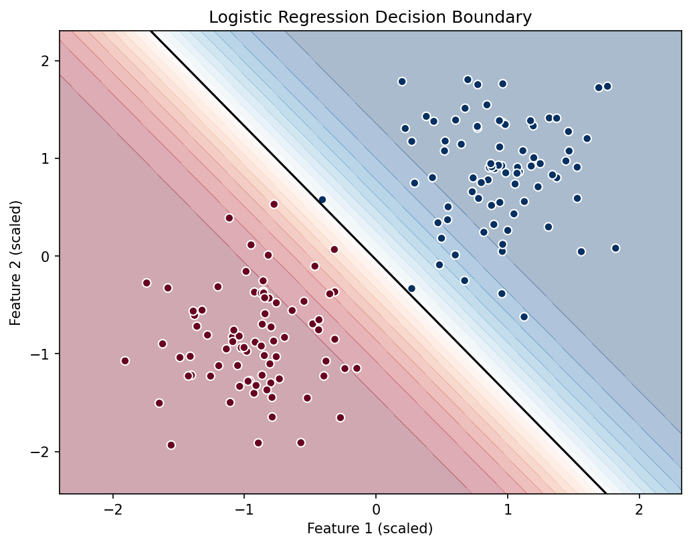

# Logistic Regression

Logistic regression predicts the probability of a binary class.

```text
z = Xw + b
p = sigmoid(z)
```

On a two-feature dataset, the model learns a straight decision boundary:



## Objective Function

The model minimizes binary log loss:

```text
J(w, b) = -(1 / n) * sum(y * log(p) + (1 - y) * log(1 - p))
```

where:

```text
p = 1 / (1 + exp(-z))
```

## Gradient

For probabilities `p`:

```text
dJ/dw = (1 / n) * X.T @ (p - y)
dJ/db = (1 / n) * sum(p - y)
```

## Role Of Each Parameter

- `w`: weights that control how each feature changes the log odds.
- `b`: bias term.
- `learning_rate`: size of each gradient descent update.
- `epochs`: number of optimization steps.
- `threshold`: probability cutoff used by `predict`, usually `0.5`.

## Common Failure Modes

- Labels are not binary.
- Features are not scaled, causing slow or unstable training.
- Classes are not linearly separable enough for a straight boundary.
- Learning rate is too high.
- Severe class imbalance makes accuracy misleading.

## When To Use It

Use logistic regression for binary classification problems where a linear decision boundary is a reasonable starting point.
