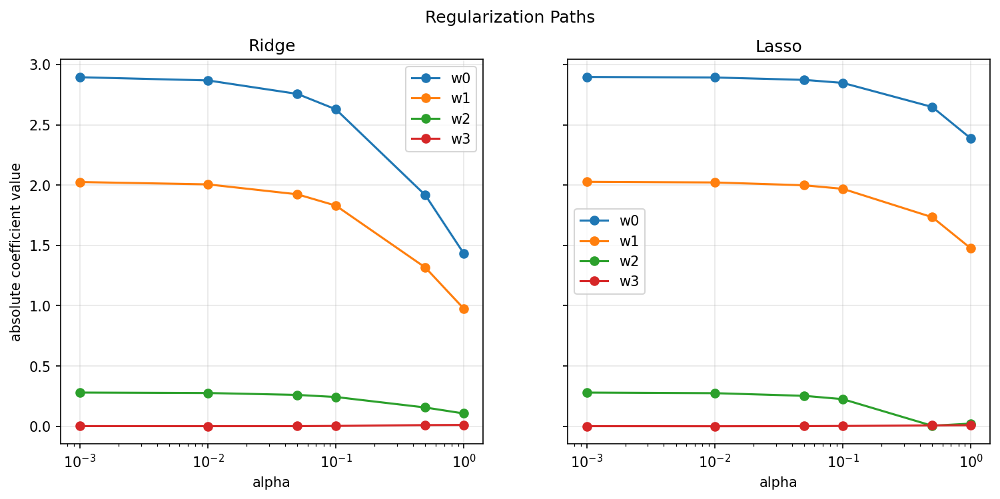

# Ridge Regression

Ridge regression minimizes the mean squared error plus an L2 penalty:

```text
J(w, b) = MSE(y, y_hat) + alpha * ||w||_2^2
```

The bias term is not regularized.

## Why It Helps

Ridge reduces coefficient magnitude and can improve generalization when features are noisy or correlated.

The regularization path below compares how Ridge and Lasso shrink coefficient magnitudes as `alpha` increases:



## Objective Function

```text
y_hat = Xw + b
J(w, b) = (1 / n) * sum((y_hat - y)^2) + alpha * sum(w^2)
```

## Gradient

```text
dJ/dw = MSE_gradient_w + 2 * alpha * w
dJ/db = MSE_gradient_b
```

Only the weights receive the penalty gradient. The bias stays unregularized.

## Role Of Each Parameter

- `w`: feature weights.
- `b`: bias term.
- `alpha`: strength of the L2 penalty.
- `learning_rate`: step size for gradient descent.
- `epochs`: number of optimization steps.

## Common Failure Modes

- Very large `alpha` can underfit by shrinking weights too much.
- Very small `alpha` behaves almost like ordinary linear regression.
- Unscaled features can make the penalty affect features unevenly.
- A high learning rate can make training unstable.

## When To Use It

Use ridge regression when the target is continuous and features are correlated, noisy, or likely to overfit with plain linear regression.
