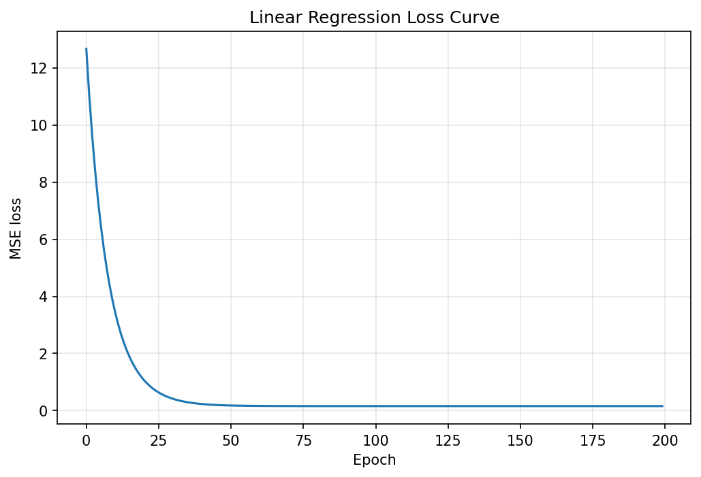

# Getting Started

This tutorial trains a simple linear regression model.

```python
import numpy as np

from miniml.linear_model import LinearRegression
from miniml.metrics.regression import MSE
from miniml.model_selection.split import train_test_split

X = np.array([[1], [2], [3], [4], [5], [6]])
y = np.array([5, 7, 9, 11, 13, 15])

X_train, X_test, y_train, y_test = train_test_split(
    X, y, test_size=0.33, shuffle=True, seed=42
)

model = LinearRegression(learning_rate=0.01, epochs=1000)
model.fit(X_train, y_train)

predictions = model.predict(X_test)
print(predictions)
print("MSE:", MSE(y_test, predictions))
```

## Basic Workflow

1. Put features in `X`.
2. Put targets in `y`.
3. Split the data.
4. Fit the model on training data.
5. Predict on test data.
6. Evaluate with a metric.

## Plotting Loss

Most gradient-descent models store `loss_history`:

```python
import matplotlib.pyplot as plt

plt.plot(model.loss_history)
plt.xlabel("epoch")
plt.ylabel("loss")
plt.show()
```

Example output from `examples/plot_loss_curves.py`:


